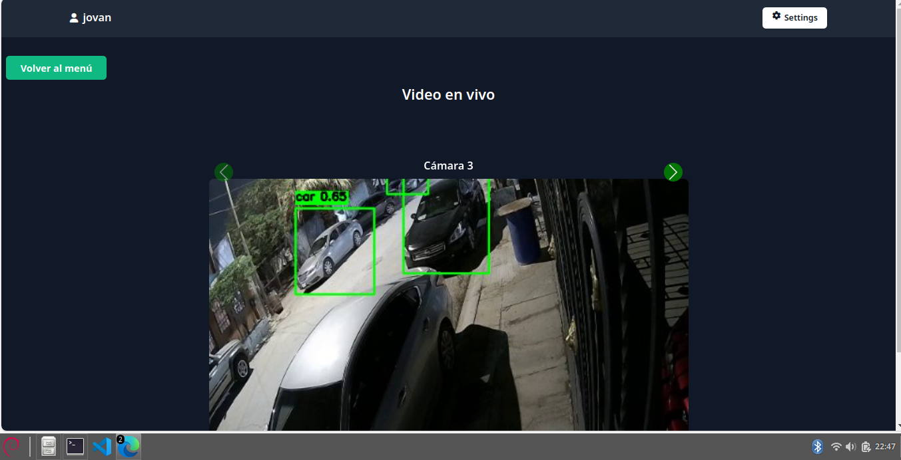

<!-- Title -->
# AI security cameras
### Website Preview
<p align="center"> 
  <kbd>
    <a href="https://varadbhogayata.github.io" target="_blank">
  </a>
  </kbd>
</p>

**Requirements**
- **Camera compatible with RTSP protocol**
- **Flask**
- **python**
- **telegram bot**


<!-- About the Project -->
## About the Project 🚀

This project has the main goal to send notifications from telegram to N users using recognition and detection of faces.
 

<!-- Features -->
## Key Features 🌟
- **Notifications by telegram**: You can set notifications using telegram API
- **User Authentication**: Secure user authentication using Flask and Werkzeug.
- **Modern UI**: Professionally designed login and signup forms with Tailwind CSS.
- **Responsive**: Works seamlessly on various screen sizes.

<!-- Getting Started -->
## Getting Started 🚦

To get started, follow these steps:

1. Clone the repository.

2. You need to install python > 3.7, Flask, yolo11n.pt and create a bot on telegram to recieve your notificarions

3. Run the application.
   ```bash
   python main.py
   ```

3. Open the app in your browser: [http://localhost:5000](http://localhost:5000)


<!-- JSON File -->
## JSON File 📋

This template uses a simple JSON file (`users.json`) to store user information for quick setup and testing. While convenient for development, it's not suitable for production due to security concerns.

### Secure JSON File Operations:

- **Restrict Access**: Ensure proper file permissions to restrict access.

- **Backup Regularly**: Regularly back up the JSON file to prevent data loss.

- **Limit Sensitive Data**: Avoid storing sensitive information directly in the JSON file.

<!-- Security -->
## Security 🔐

This template follows security best practices:

- **Password Hashing**: User passwords are securely hashed using the SHA-256 algorithm.

- **Session Management**: Flask session management for secure user authentication.

- **Secure Forms**: Proper validation and sanitation of user inputs in forms.

- **HTTPS**: Deploy the application with HTTPS for secure communication.

Always stay informed about the latest security updates and adapt the template accordingly.


<!-- License -->
## License 📄

This project is licensed under the MIT License - see the [LICENSE](LICENSE) file for details.


